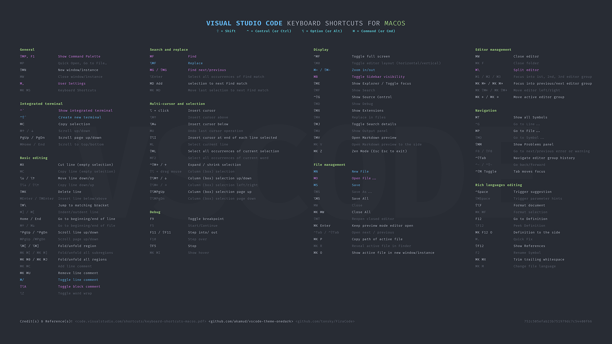
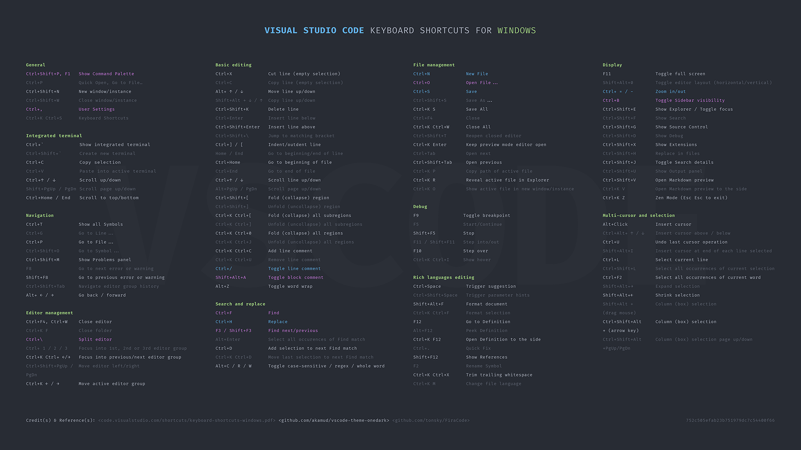

# mtbradley/vscode

###Visual Studio Code related information Including personal preferences, settings and guides

**Contents**

- Wallpapers (Updated 22 August 2020) Custom designed keyboard shortcut wallpapers for macOS and Windows available 1080, 4k and 8k resolution.

## VSCode macOS Wallpaper  

*VSCode macOS Wallpaper Download*

| Resolution | Format | Link |
|:-----------|:------|:--------|
| 1920 x 1080 | PNG | [DOWNLOAD](wallpapers/vscode_keys_macos_1080.png) |
| 3840 x 2160 (4K) | PNG | [DOWNLOAD](wallpapers/vscode_keys_macos_4k.png) |
| 7680 x 4320 (8K) | PNG | [DOWNLOAD](wallpapers/vscode_keys_macos_8k.png) |

## VSCode Windows Wallpaper  
  

*VSCode Windows Wallpaper Download*

| Resolution | Format | Link |
|:-----------|:------|:--------|
| 1920 x 1080 | PNG | [DOWNLOAD](wallpapers/vscode_keys_windows_1080.png) |
| 3840 x 2160 (4K) | PNG | [DOWNLOAD](wallpapers/vscode_keys_windows_4k.png) |
| 7680 x 4320 (8K) | PNG | [DOWNLOAD](wallpapers/vscode_keys_windows_8k.png) |

##Credit(s) & Reference(s)  

- Information sourced from original VSCode documentation [macOS](https://code.visualstudio.com/shortcuts/keyboard-shortcuts-macos.pdf) [Windows](https://code.visualstudio.com/shortcuts/keyboard-shortcuts-windows.pdf)
- Colour scheme inspiration [github.com/akamud/vscode-theme-onedark](https://github.com/akamud/vscode-theme-onedark)
- Font used **Fira Code** [github.com/tonsky/FiraCode](https://github.com/tonsky/FiraCode)
